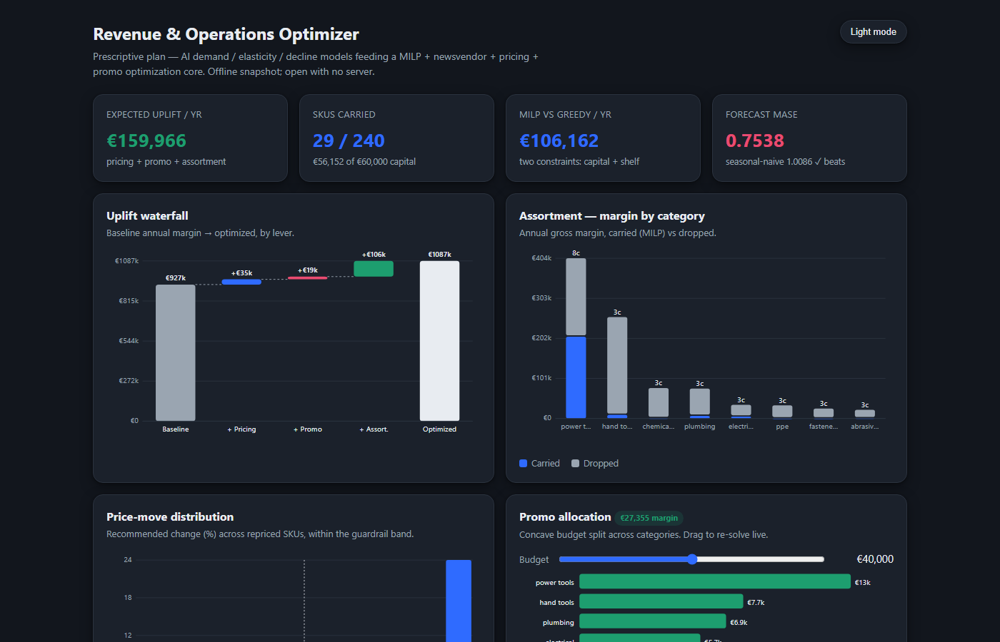
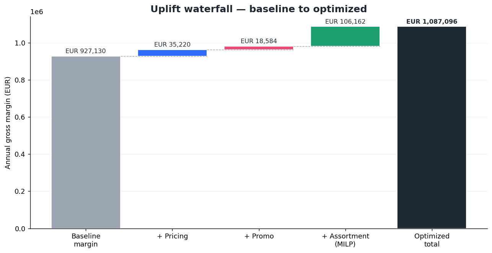
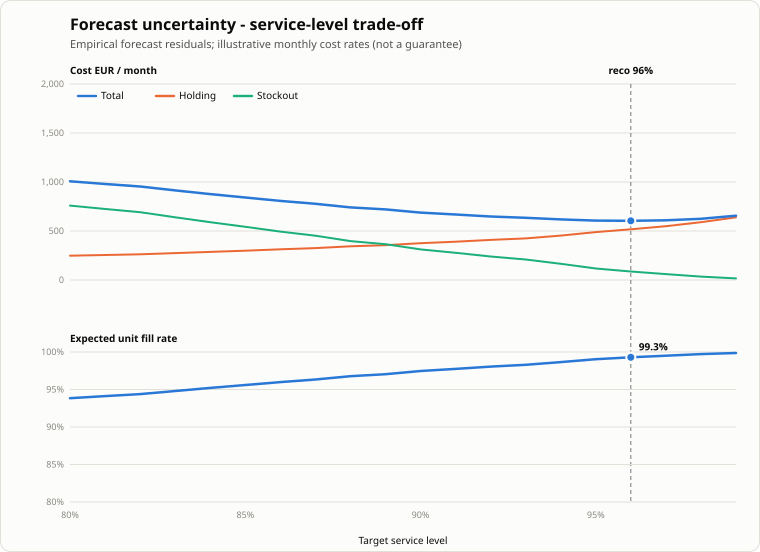
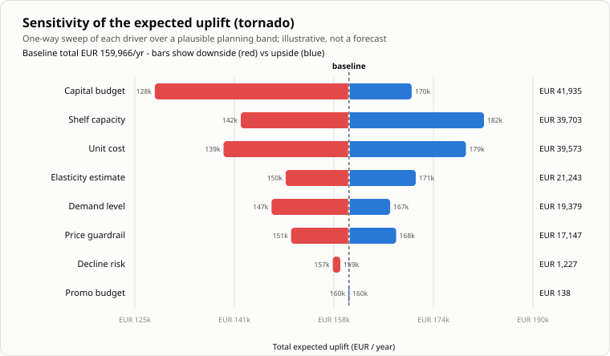
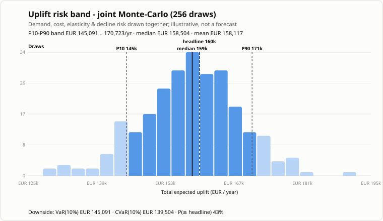

# RevOps Optimizer

[](https://github.com/Dimitres-Kisimov/revops-optimizer/actions/workflows/ci.yml)

This is a revenue-and-operations decision engine for a distributor: it forecasts
demand, estimates price elasticity and decline risk, and then feeds those
estimates into four optimizers — assortment, inventory, pricing and promotion —
to produce one prescriptive plan with a single € uplift number and a named action
list. I built it because I kept seeing "AI" projects that stop at a prediction
and "optimization" projects that assume their inputs fall from the sky. The
interesting engineering is the seam between them, so I made that seam the whole
project.



I wrote it as part of an internship application in data & AI analytics. It runs
end to end on synthetic-but-structured data with no API keys and no cloud.

**Business case:** on the seeded dataset the plan is worth a measured **~€160k/year**
of margin uplift for a mid-size industrial distributor — see
[`docs/BUSINESS_CASE.md`](docs/BUSINESS_CASE.md) for the situation, the quantified
problem and the ROI.



## What it does, concretely

`prescribe()` runs the predictive layer, hands its outputs to the optimization
core, and assembles a plan. On the seeded dataset (240 SKUs, eight categories):

```
Expected uplift        EUR      159,966 / year
  - pricing            EUR       35,220
  - promo              EUR       18,584
  - assortment (MILP)  EUR      106,162
SKUs carried           29 of 240   (capital EUR 56,152 / 60,000)
MILP vs greedy         EUR      106,162 / year   (two constraints: capital + shelf)
Forecast MASE          0.75  (seasonal-naive 1.01; beats naive)
Decline-risk ROC-AUC   0.99
```

The predict→optimize handoff: the demand forecast replaces the raw average in the
newsvendor and the assortment MILP; the *estimated* elasticity (not the true one)
drives the pricing markup; the decline probability haircuts fragile SKUs so the
range decision drops them first. The maths is written out in
[`docs/OPTIMIZATION_MODELS.md`](docs/OPTIMIZATION_MODELS.md) and the handoff in
[`docs/METHODOLOGY.md`](docs/METHODOLOGY.md).

### Forecast uncertainty → service level (fill rate)

A point forecast is not enough to set inventory — a planner sets a *service
level*. So the forecaster's own one-step residuals (how wrong it actually is)
become the demand-uncertainty: standardized, pooled, and swept from an 80%→99%
target to trade off safety stock, holding cost, expected fill rate and expected
stockout cost. On the seeded assortment the cost-minimising recommendation is a
**96% target ≈ 99.3% expected unit fill rate**. The honest catch: the residuals
are **fat-tailed** — the 95% quantile sits at ~2.15σ, not the textbook 1.64σ — so
a Gaussian safety stock would under-provision. Cost rates are labelled
illustrative, not a guarantee.



### How robust is the € number? Scenarios + a sensitivity tornado

A single point estimate invites the obvious question: *how much should I trust it,
and which assumption moves it most?* So the same predict→optimize core is re-run
under named business scenarios and swept one driver at a time. The forecaster is
trained **once**; each scenario perturbs its outputs (a demand multiplier on the
forecast, a cost multiplier on the master, an elasticity/risk multiplier) and
re-solves the MILP, pricing and promo exactly as `prescribe()` does — so the
*Baseline* scenario reproduces the €159,966 headline to the cent.

```
Scenario                    Total EUR/yr     vs baseline
Baseline                         159,966              +0
Demand downturn -15%             136,528         -23,438
Cost inflation +8%               139,487         -20,479
Tight capital -25%               122,167         -37,799
Promo push +50%                  160,025             +58
More elastic market +20%         149,622         -10,344
```

The one-way **tornado** ranks each driver by the swing it puts on the total uplift.
On the seeded dataset the headline is most exposed to the two assortment
constraints and to input cost — and barely to the promo budget:

```
Capital budget   EUR 128,266 .. 170,201   swing 41,935
Shelf capacity   EUR 142,305 .. 182,008   swing 39,703
Unit cost        EUR 139,487 .. 179,061   swing 39,573
Elasticity est.  EUR 149,622 .. 170,866   swing 21,243
Demand level     EUR 147,311 .. 166,690   swing 19,379
Price guardrail  EUR 150,516 .. 167,663   swing 17,147
Decline risk     EUR 157,317 .. 158,545   swing  1,227
Promo budget     EUR 159,868 .. 160,007   swing    138
```

That the two biggest bars are *capital* and *shelf* is consistent with the honest
note below — the six-figure MILP-vs-greedy advantage lives on the assortment
constraints. The perturbation bands are **illustrative planning ranges, not a
forecast**, and each figure is what the model computes under that assumption, not
a guarantee.



### A confidence band on the € — a joint Monte-Carlo (interactions)

The tornado sweeps one driver at a time, so it reads *local* sensitivity and
**not interactions**. The obvious follow-up — *taking all the uncertainty
together, what is the range, and how bad is the downside?* — is a joint
**Monte-Carlo**. `revops/simulate.py` draws the four predictive uncertainties
(demand, unit cost, estimated elasticity, decline risk) **together** from
three-point (triangular) planning distributions — the *same* bands the tornado
uses — and re-solves the identical predict→optimize core for each draw. Decision
levers stay at baseline; every draw is re-optimized, so the band is the range of
*achievable* uplift. Sampling is a fixed-seed Latin-Hypercube design, so the
CSV/SVG are byte-identical across re-runs (deterministic, no wall-clock).

```
Headline point estimate          EUR 159,966 / year   (the mode draw = the plan)
P10 – P90 confidence band        EUR 145,091 .. 170,723 / year
Median (P50)  /  mean            EUR 158,504  /  158,117
Downside VaR(10%)                EUR 145,091   (headline-at-risk EUR 14,875)
Expected shortfall  CVaR(10%)    EUR 139,504   (mean of the worst 10% of draws)
P(outcome >= headline)           43%           (256 draws, seed 20260807)
```

The honest read: once the four uncertainties move **jointly**, the median
(~€158.5k) lands *below* the €159,966 point estimate and there is only a ~43%
chance of clearing it — a mildly optimistic, slightly left-skewed profile a
single number (or a one-way tornado) hides. The bands are **illustrative
planning ranges on synthetic data, not a forecast**; each figure is what the
model computes under a drawn assumption, not a guarantee.



## Run it

```bash
pip install numpy scipy matplotlib openpyxl python-pptx torch pytest ruff

python data/generate_skus.py && python data/generate_history.py   # synthetic data
python -m revops --quiet          # headline plan + decision cards
python -m revops.scenario --quiet # scenario library + sensitivity tornado (CSV + SVG)
python -m revops.simulate --quiet # joint Monte-Carlo uplift risk band (CSV + SVG; ~a few min)
python -m revops.report           # deliverables/ (json, xlsx, pdf, pptx, csv)
python powerbi/build_star.py      # powerbi/data/ star-schema CSVs
python web/build_data.py          # web/data.js  → open web/index.html offline
pytest -q                         # 21 tests, ~8s
```

Knobs: `--budget`, `--shelf-capacity-m3`, `--service-level`, `--promo-budget`,
`--price-guardrail`, `--json out.json`. The simulator takes `--draws N` (default
256) and `--hurdle EUR` (probability the outcome clears a target; defaults to the
headline point estimate).

## What comes out

- **`deliverables/`** — an executive PDF/PPTX deck (waterfall, assortment
  before/after, inventory frontier, the forecast-uncertainty service-level curve,
  price-move distribution, promo allocation, a model-quality slide, recommended
  actions), a styled Excel workbook (with a `ServiceLevel` sheet), `actions.csv`
  (per-SKU reorder + reprice), and the service-level curve as
  `service_level_curve.csv` + a hand-drawn `service_level_curve.svg`, plus the
  robustness pack — `scenario_summary.csv` (named scenarios vs baseline),
  `sensitivity_tornado.csv` and a hand-drawn `sensitivity_tornado.svg`, and the
  joint Monte-Carlo risk band — `uplift_simulation.csv` (a tall, DAX-ready P10/
  P50/P90 + VaR/CVaR summary) and a hand-drawn `uplift_distribution.svg`.
- **`powerbi/`** — a star schema (`fact_prescription` + `dim_sku/category/date` +
  a scalar KPI table) with the KPIs written as real DAX, and a build spec for the
  three report pages. Run the simulator first and it also emits a disconnected
  `kpi_uplift_risk` table (the P10/P50/P90 band + VaR/CVaR) with matching DAX
  measures (§10). No tenant needed to produce or review it — that's stated
  honestly in [`powerbi/README.md`](powerbi/README.md).
- **`web/index.html`** — a dependency-free dashboard (hand-drawn SVG charts,
  light/dark, a promo what-if slider that re-solves the concave allocation in the
  browser). Opens straight off disk.

The [`docs/USE_CASE.md`](docs/USE_CASE.md) walks the whole quarterly decision as a
narrative.

## Honest limitations

- **The data is synthetic.** It is generated with real structure — seasonality, a
  risk-linked trend, a genuine price↔quantity relationship from each SKU's true
  elasticity — so the models have something to learn and recover, but it is not a
  real distributor's ledger.
- **The MILP-vs-greedy gap depends on the shelf constraint.** With only the
  capital budget, ranking by GMROI is already optimal and the gap collapses to
  near-zero. The headline six-figure advantage is real *because* a second (shelf)
  constraint binds — relax `--shelf-capacity-m3` and you can watch it shrink. I'd
  rather say that plainly than imply the MILP always wins.
- **The models are the smallest credible version of each** — a small global MLP
  forecaster, a from-scratch ridge elasticity, a from-scratch logistic decline
  classifier. The goal was a clear, honest pipeline, not a leaderboard.
- **The service-level curve's cost rates are illustrative.** Overage is one
  month's holding at each SKU's own rate; underage is the lost unit margin (times
  an optional goodwill/expedite penalty, default 1×). It is a single-period
  monthly model on synthetic data — the *recommended* service level and fill rate
  are what that model computes, not a guaranteed field outcome. The empirical
  prediction intervals, though, are a genuine, deterministic read of the
  forecaster's own error.
- **The Monte-Carlo band is only as good as its input distributions.** The
  triangular planning ranges are assumptions, not fitted from data, and each draw
  is *re-optimized* (perfect adaptation), so the band describes the spread of the
  best achievable € across conditions — not the drift of a frozen plan or a
  probabilistic forecast of realized results. It is deterministic (fixed seed,
  Latin-Hypercube), so the figures are exact-as-computed and reproducible, but
  they are modelled, not measured.

## A note on fit

I put this together while applying for a Data & AI Analytics working-student role
at Würth. It lines up with what that team does day to day: BI and dashboarding
(the Power BI star schema + DAX, and the offline web dashboard), predictive
analytics feeding real decisions (forecast/elasticity/decline → optimization),
and the Python/SQL-shaped data work around it, with Excel as a first-class
deliverable. The distributor framing isn't decoration — it's the setting these
techniques actually get used in.

---

Built and maintained by Dimitres Kisimov · © 2026 Dimitres Kisimov — all rights reserved; published for portfolio review. See LICENSE. · synthetic data, no
keys, runs offline.
